<div align="center">



# sens (СЕНС)

**Експериментальна мова й дослідницька система бінарних доменів, законів і exact-width об'єктів**

*An experimental language and research system for law-governed binary domains*

[](https://github.com/juv4uk/sens/actions/workflows/ci.yml)
[](https://github.com/juv4uk/sens/actions/workflows/surface-drift-check.yml)

**Українська — перша мова проєкту.**

</div>

---

## Що таке SENS

SENS виріс із експериментів навколо Lisp і exact binary identity, але поточна
архітектура вже не є “256 функцій у flat SID8 table”.

Поточна owner-парадигма:

```text
semantic object
=
binary number
+ exact semantic domain
+ proved/admitted law
```

Коротко:

```text
bits + domain + law -> meaning
```

Це означає:

- однакові біти не гарантують однакової семантики;
- однакова ширина не означає один semantic domain;
- вільна binary coordinate не є функцією;
- людська назва не є canonical machine identity;
- Rust/FPGA/opcode/hash/AST/cache/registry не мають права непомітно вигадувати
  семантику за мову.

Поточна карта:
[`docs/current-binary-domain-architecture.md`](docs/current-binary-domain-architecture.md).

Точка входу для питання “що зараз чинне?”:
[`CURRENT.md`](CURRENT.md).

---

## Core і Core-Math

SENS зараз має дві пов'язані, але незалежні дослідницькі лінії.

### Core

Core реконструює й продовжує історичну лінію:

```text
Lisp I -> Lisp 1.5 -> SENS
```

Дослідження йде строго по фазах:

```text
HISTORICAL-INGEST
        ↓
STRUCTURAL-DISCOVERY
        ↓
SENS-DERIVATION
```

Тобто спочатку ми чесно фіксуємо історичні capabilities, потім шукаємо
families/generators/axes, і лише після цього виводимо native SENS roots,
laws і coordinates.

Ключове правило:

```text
historically present != fundamental in SENS
derivable in SENS     != absent from history
```

### Core-Math

Core-Math досліджує математичні закони над binary objects незалежно від Lisp
vocabulary й Core placement.

Мінімальна модель:

```text
binary input(s)
+ admitted mathematical law
-> binary output
```

Core-Math може піти іншою domain structure, ніж Core. Це нормально.

---

## Де Core і Core-Math можуть зустрітися

Допустимі три результати:

```text
DIVERGENT
COMPLEMENTARY
CONVERGENT
```

Convergence заробляється лише коли незалежно збігаються:

```text
same binary object
+ same exact domain
+ same semantic equation
+ same law
+ cross-proof
```

### Позитивний контроль

Selector composition уже має bounded cross-proof:

- Core виводить semantic selector extension;
- Core-Math незалежно виконує binary law;
- current generated D4/D5 selector descendants сходяться по exact bits/width;
- довільна перестановка coordinates ламає convergence.

### Негативний контроль

Selector-path і exact-Q group-factor можуть обидва використовувати:

```text
child = 2*parent + bit
```

але це **різні semantic domains і різні laws**.

Cross-domain apply має fail closed.

Тобто:

> **однакова машинна формула не є однаковою семантикою.**

---

## Domain, carrier, mechanism

Ці три поняття не можна змішувати:

```text
domain     = law-bearing semantic context
carrier    = exact bit/width representation
mechanism  = execution / storage / transport substrate
```

Наприклад:

```text
D7.SoundCell [carrier=W7]       # semantic domain
D7.LocalOrdinal [carrier=W7]    # інший semantic context
W7                              # carrier only
FPGA / Rust / radio             # mechanism only
```

Width говорить, скільки бітів має об'єкт. Domain + law пояснює, **що ці біти
означають**.

---

## Поточна domain map

Поточний high-level status:

| Domain | Status |
|---|---|
| D1 | ratified PredicateBit |
| D2 | ratified structural `racanā2` |
| D3 | ratified Core foundation |
| D4 | ratified Core foundation |
| D5 | ratified width/domain ontology; historical/structural filling триває |
| D6 | ratified width/domain ontology; unresolved occupancy лишається UNKNOWN |
| D7 | ratified Sound7 + local śloka/sūtra ordinals; не general arithmetic Number |
| D14 | research: Pāṇini grammar graph |
| D24/D48/... | research: exact Number / FPGA-oriented numeric domains |

**Ratified width не означає blanket occupancy.**

D6 PURE-UNKNOWN coordinates лишаються untouched, доки закон не заробить
resident. “Тут є вільне місце” не є placement proof.

---

## Generated descendants і parentless roots

Для generated child сильний шлях виглядає так:

```text
exact parent
+ proved local delta / generator
-> generated child
```

Але parentless semantic root — інший випадок:

```text
PROVEN-ROOT
!=
PROVEN-WIDTH
!=
PROVEN-COORDINATE
```

Тому root може бути семантично доведеним, але лишатися:

```text
domain = UNKNOWN
coordinate = UNPLACED
```

Це не недолік. Це чесний epistemic state.

---

## D6: UNKNOWN — це результат, а не порожня клітинка

Поточна дисципліна для D6:

- не шукати residents за numeric adjacency;
- не ранжувати “красиві” вільні bit patterns;
- не імпортувати Core-Math law без bridge/domain proof;
- не використовувати chronology як width proof;
- не заповнювати координати лише тому, що вони free.

Якщо exact law не знайдений, **NO-CANDIDATE / UNKNOWN** є успішним науковим
результатом.

---

## Human surfaces

Людські назви потрібні людям, але не володіють machine semantics.

Проєкт підтримує/досліджує:

- українські surfaces;
- English;
- Sanskrit;
- symbolic spellings;
- historical Lisp names як provenance.

Наприклад `CAR`, `ADD`, `Sound`, `Number`, `TRANSFORMER` — це human
projection/documentation, а не достатня canonical identity.

Canonical source extension: **`.lisp`**.

Розширення файлу теж не є семантикою.

---

## Execution substrates

Rust — reference mechanism, не semantic authority.

Те саме правило для:

- C;
- Common Lisp;
- WASM;
- GraalVM;
- FPGA;
- GPU;
- Prolog / Datalog / CLIPS;
- radio/wire transports.

Правильна залежність:

```text
admitted semantic object/law
        ↓
execution mechanism
        ↓
observation
```

а не навпаки.

---

## Wire і radio

Транспортний шар не змінює semantic identity:

```text
semantic SENS
-> canonical exact-width wire/container
-> framing / CRC / FEC / ARQ
-> RF profile / physical channel
```

Frequency, modulation, power, radio profile й sync — mechanism.

> **Frequency is a path through the world, not a path through the SENS semantic tree.**

---

## Research discipline

Governed Core/Core-Math task має явно сказати:

```text
PHASE
DOMAIN
BINARY OBJECT
LAW
WITNESS
FALSIFIER
STATUS
RELATION
```

PHASE:

```text
HISTORICAL-INGEST
STRUCTURAL-DISCOVERY
SENS-DERIVATION
```

Валідні результати включають:

```text
ratified
generated
derived
falsified
unknown / unresolved
divergent
complementary
convergent
```

СЕНС не вимагає, щоб кожен експеримент “щось знайшов”. Falsification і
NO-CANDIDATE зупиняють нумерологію й повторення тупикових пошуків.

---

## Що вже сильніше за просто ідею

Поточні executable evidence families включають:

- exact-width/binary-domain guards;
- selector generation and closure;
- Core ↔ Core-Math selector convergence;
- cross-domain separation;
- Core-Math `bits + law -> bits`;
- exact-Q family/role law;
- historical D5/D6 ledgers;
- D6 PURE-UNKNOWN attacks;
- residue/root domain falsifiers;
- foundation/substrate experiments;
- canonical wire / manual-human-wire mechanisms.

Див. [`docs/benchmarks.md`](docs/benchmarks.md) для current evidence index.

---

## Benchmark policy

Performance не визначає семантику.

Ми вимірюємо:

- instruction counts;
- branches;
- allocations;
- wire size;
- derivation cost;
- closure growth;
- cache behavior;
- mechanism performance.

Але:

> **швидша реалізація не стає правильнішою семантично через швидкість.**

CI повинен насамперед fail-closed ловити semantic/parity/identity regressions.
Hosted wall-clock evidence — діагностика, якщо немає контрольованого regression
protocol.

---

## Семантична влада

Поточна карта:
[`docs/semantic-authority-map.md`](docs/semantic-authority-map.md).

Коротко:

```text
owner/ratified scoped decisions
        ↓
machine-readable contracts / admitted laws
        ↓
executable witnesses + falsifiers
        ↓
reference implementations
        ↓
generated projections / docs
        ↓
historical archive
```

Нижчий шар не має права тихо перевизначити вищий.

---

## Локальний запуск

Базовий Rust workspace:

```bash
cargo test --workspace
```

Запуск CLI залежить від поточного workspace/profile setup; перед роботою з
runtime дивіться [`CURRENT.md`](CURRENT.md) і відповідні CI workflows.

Research harnesses живуть переважно в:

```text
benchmarks/
scripts/
docs/research/
.github/workflows/
```

---

## З чого читати проєкт

1. [`CURRENT.md`](CURRENT.md) — що чинне зараз.
2. [`docs/current-binary-domain-architecture.md`](docs/current-binary-domain-architecture.md) — архітектура.
3. [`docs/language-core.md`](docs/language-core.md) — Core/Core-Math model.
4. [`docs/semantic-authority-map.md`](docs/semantic-authority-map.md) — authority.
5. [`STATUS.md`](STATUS.md) — короткий status.
6. [`docs/benchmarks.md`](docs/benchmarks.md) — current evidence index.
7. `docs/research/**` — dated research evidence.
8. `docs/archive/**` — superseded history, не current spec.

---

## Historical provenance

Проєкт раніше називався `my-lisp` і проходив через flat SID8 / Function8 та
multiple Core-profile phases.

Ці фази **не стираються**. Вони збережені як provenance, compatibility evidence
й falsifiers.

Але current ontology інша:

```text
not: function = one flat 8-bit slot

current:
semantic object
=
binary number
+ exact domain
+ proved law
```

---

## English · auxiliary

SENS is an experimental language/research system built around law-governed
binary domains.

Its current ontology is:

```text
semantic object = binary number + exact domain + proved/admitted law
```

Core reconstructs early Lisp historically, discovers structure, then derives
native SENS semantics. Core-Math independently studies mathematical laws over
binary objects.

Equal bits, equal width, or equal machine transforms do not imply equal
semantics. Core and Core-Math may diverge, complement each other, or converge
only after an independent cross-proof.

Unknown coordinates are legitimate. Free space is not semantic evidence.
Execution substrates and transports remain mechanisms.

See [`CURRENT.md`](CURRENT.md) and
[`docs/current-binary-domain-architecture.md`](docs/current-binary-domain-architecture.md).

---

## Ліцензія

Див. [`LICENSE`](LICENSE).
